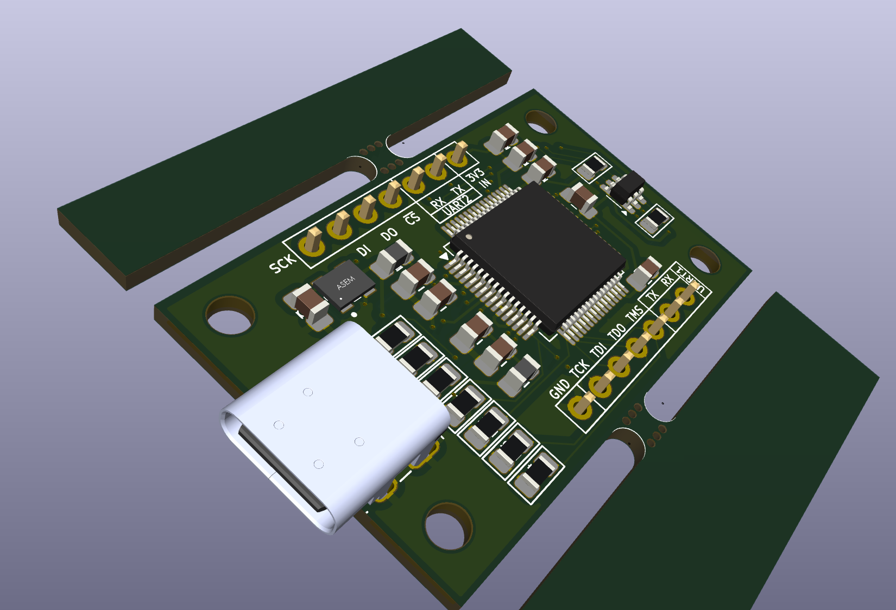

# FT4232H Breakout Board

Breakout board for the FT4232H to support SPI flash programming and JTAG, as well as two UARTs.

  

# Contents

 - [`ft4232h-bob-v0/`](ft4232h-bob-v0/) - Rev 0 of hardware
 - [`mfgr/`](mfgr/) - Files used to initial the EEPROM in a newly built device. See [`mfgr/README.md`](mfgr/README.md)
 - [`ft4232h-bob-v0/docs/`](ft4232h-bob-v0/docs/) - Documentation:
   - [`ft4232h-bob-v0/docs/Improvements.md`](ft4232h-bob-v0/docs/Improvements.md) - Improvements to make to for next revision of board